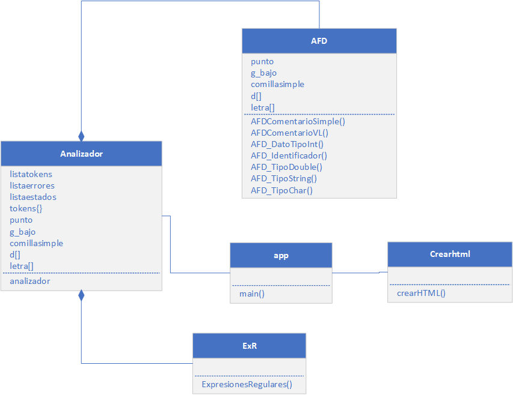

# MANUAL TÉCNICO 
* UNIVERSIDAD DE SAN CARLOS DE GUATEMALA 
* Proyecto 1
* Laboratorio de Lenguajes Formales de Programación 
* Linda Madelin Fabiola Quelex Sep
* 201403745


# Proyecto
Analizador léxico de lenguaje Simple C

# Palabras clave

* Análisis léxico
* Python
* HTML
* Tokens

# Introducción
El presente ensayo es sobre el proyecto 1 del 
Laboratorio de Lenguajes Formales de Programación, de la Facultad de Ingeniería, de la 
Universidad de San Carlos de Guatemala. 
El proyecto fue nombrado como “Analizador Léxico del Lenguajes Simple C".

Para la realización del proyecto se utilizó el lenguaje 
de programación Python, el paradigma de 
programación orientada a objetos. 

La aplicación permite la carga de un archivo con extensión (.sc) el cual brinda el código fuente a analizar por la apliación, al ser enviadO el contenido del archivo, el analizador retorna reportes con los resultados, a través de HTML. 

# Desarrollo

Para el desarrollo del proyecto 1 se desarrolló e implementó lo siguiente: 


1. Se definió una carpeta para los almacenar los archivos de entrada, denominado "ENTRADAS".

2. Ejemplo de código fuente

Se desarrolló un código fuente como prueba y para la definición de tokens. A continuación se presenta: 


```Simple C
// comentario de una línea

/*
Comentario
De varias
Líneas
*/

Int _dato_int = 67;
Double Dato_double  =39.87;
String dato_String1= "Hola mundo";
Char _Dato_tipo__Char1 = 'a';
Boolean _ = true;
Boolean B= True;
```

3. Lexemas
   
Con el código fuente de prueba se definireron los lexemas que acontinuación se listan:  


- // comentario 1 línea sdri0werw023"#"#" 
- /*línea 1 comentario
    línea 2 comentario"!"#
    línea 3 comentario
   */
- Int
- Double
- String
- Char
- Boolean
- \+
- \-
- \*
- /
- %
- ==
- !=
- \>
- \>=
- <
- <=
- &&
- ||
- !
- ;
- if 
- (
- dato1_
- _datos2
- )
- {
- }
- else
- while
- do
- void
- return


4. Definición de tokens
   
Con los lexemas definidos de construyó la tabla de tokens, para Simple C

| Token                   | Descripción                          | Patrón                 |
| ----------------------- | ------------------------------------ | ---------------------- |
| comentario_simple       | Línea de comentario simple           | ^\/\/.*\n              |
| comentario_var_líneas   | Comentario de varias líneas          | \/\*.*\*\/             |
| tipo_int                | Tipo de dato entero                  | int                    |
| tipo_double             | Tipo de dato decimal                 | double                 |
| tipo_string             | Tipo de dato String                  | string                 |
| tipo_char               | Tipo de dato Char                    | char                   |
| tipo_boolean            | Tipo de dato boolean                 | boolean                |
| suma                    | Operador suma                        | +                      |
| resta                   | Operador resta                       | -                      |
| multiplicacion          | Operador multiplicación              | *                      |
| division                | Operador división                    | /                      |
| resto                   | Operador resto                       | %                      |
| igualacion              | Operador igualación                  | ==                     |
| signacion               | Operador de asignación               | =                      |
| diferenciacion          | Operador diferenciación              | !=                     |
| mayor_que               | Operador mayor que                   | >                      |
| mayor_o_igual_que       | Operador mayor o igual que           | >=                     |
| menor_que               | Operador menor que                   | <                      |
| menor_o_igual_que       | Operador menor o igual que           | <=                     |
| and                     | Operador and                         | &&                     |
| or                      | Operador or                          | \|\|                   |
| not                     | Operador not                         | !                      |
| punto_coma              | Punto y coma                         | ;                      |
| condicional             | Condicional                          | if                     |
| par_abierto             | Paréntesis abierto                   | (                      |
| par_cerrado             | Paréntesis cerrado                   | )                      |
| dato_tipo_Int           | Dato tipo Int                        | ^\d+$                  |
| dato_tipo_boolean_true  | Dato tipo boolean                    | true                   |
| dato_tipo_boolean_false | Dato tipo boolean                    | false                  |
| identificador           | Cualquier identificador del lenguaje | [a-zA-Z_][a-zA-Z0-9_]* |
| llave_abierta           | Llave abierta                        | {                      |
| llave_cerrada           | Llave cerrada                        | }                      |
| condicional_else        | Condicional else                     | else                   |
| iterativo_while         | Iteración con ciclo while            | while                  |
| iterativo_do            | Iteración con ciclo do while         | do                     |
| reservada_void          | Palabra reservada                    | void                   |
| reservada_return        | Retorno                              | return                 |
| dato_int                | Dato tipo entero                     | [0-9]+                 |
| dato_double             | Dato tipo double                     | [+-]?[0-9]*\.[0-9]+    |
| dato_string             | Datos tipo String                    | ".*"                   |
| dato_char               | Dato tipo char                       | '(.*){1}'              |


5.  Análisis léxico

Con el código fuente de prueba, los lexemas y la tabla de tokens definidos se presenta un ejemplo de análisis léxico:

| Lexema                                                        | Token                 |
| ------------------------------------------------------------- | --------------------- |
| // comentario 1 línea sdri0werw023"#"#"                       | comentario_simple     |
| /*línea 1 comentario línea 2 comentario línea 3 comentario */ | comentario_var_líneas |
| Int                                                           | tipo_int              |
| Double                                                        | tipo_double           |
| String                                                        | tipo_string           |
| Char                                                          | tipo_char             |
| Boolean                                                       | tipo_boolean          |
| +                                                             | suma                  |
| -                                                             | resta                 |
| *                                                             | multiplicacion        |
| /                                                             | division              |
| %                                                             | resto                 |
| ==                                                            | igualacion            |
| !=                                                            | diferenciacion        |
| >                                                             | mayor_que             |
| >=                                                            | mayor_o_igual_que     |
| <                                                             | menor_que             |
| <=                                                            | menor_o_igual_que     |
| &&                                                            | and                   |
| \/\/                                                          | or                    |
| !                                                             | not                   |
| ;                                                             | punto_coma            |
| if                                                            | condicional           |
| (                                                             | par_abierto           |
| dato1_                                                        | identificador         |
| _datos2                                                       | identificador         |
| )                                                             | par_cerrado           |
| {                                                             | llave_abierta         |
| }                                                             | llave_cerrada         |
| else                                                          | condicional_else      |
| while                                                         | iterativo_while       |
| do                                                            | iterativo_do          |
| void                                                          | reservada_void        |
| (parametro,)*                                                 | parametro             |
| return                                                        | reservada_return      |

6.  Conversión de expresión regular a AFD a través del método del árbol 

El siguiente proceso fue la definición de Automátas Finitos Deterministas (AFD) a través del método del árbol, que a continuación de presenta el detalle: 

<ol>
<li><p>Método del árbol</p></li>

<p>Detalle</p>
<p></p>
</ol>

7. Definición de Clases

   * Clase AFD(): esta clase contiene la implementación de los autómatas finitos deterministas para los tokens de: (1) ComentarioSimple, (2)Comentario de Varias Líneas, (3)Datos tipo entero, (4) Datos tipo decimal, (5) Identificadores, (6) Datos tipo String y (7) Datos tipos Char. A continuación se presenta como ejemplo la implementación del AFD de Identificador:
  
   ```def AFD_Identificador(self,lexema):
        estado=0 
        estados_aceptacion = [1]
        reconocido: str = ''
        er= '_|L(_|L|d)*'
        for caracter in lexema:
            if estado==0:
                if caracter in self.l :
                    estado=1
                    reconocido+=caracter
                elif caracter in self.g_bajo:
                    estado=1
                    reconocido+=caracter
                else:
                    return False
            elif estado==1:
                if caracter in self.l:
                    estado=1
                    reconocido+=caracter
                elif caracter in self.d:
                    estado=1
                    reconocido+=caracter
                elif caracter in self.g_bajo:
                    estado=1
                    reconocido+=caracter
                else:
                    return False
        return estado in estados_aceptacion
    ```

   * Clase Analizador(): esta clase requiere de la clase anterior para la implementación del análisis léxico, a través de un diccionario agruparon los tokens que requieren de AFD y los que no. Esta clase también permite almacenar las salidas en listas, las cuales serán enviadas a la clase "crearHTML". 
  
   * Clase crearhtml(): se encarga de la generación de reportes a traves de HTML, muestras reportes de Token, Estados y Errores. 

   * Clase ExR(): permite completar la información de los reportes, por ejemplo las Expresiones Regulares (ER) definidas para cada AFD. 

   * Clase app(): esta clase es como la clase main, donde requeire de la clase "analizador" para interactuar (mostrar y solicitar) al usuario a través de consola, como se muestra en la siguiente imagen: 

       <p></p>
  
8. Diagrama de clases
  
    
  